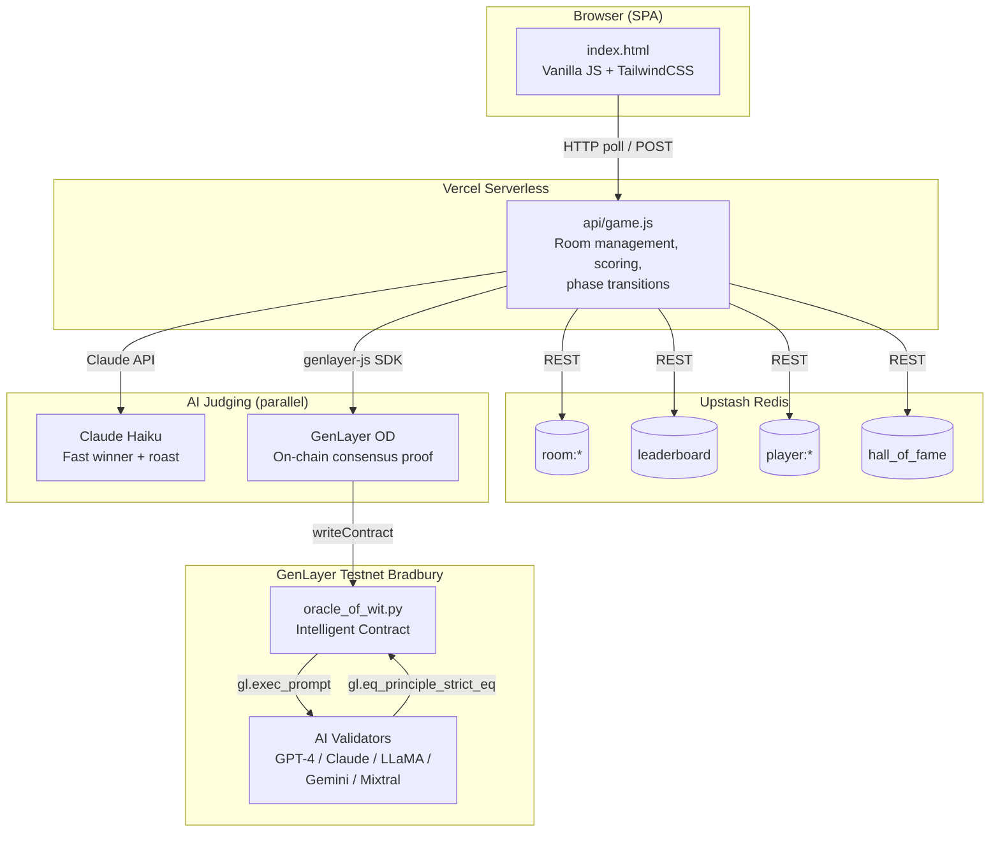

# Oracle of Wit

> **The AI humor prediction game powered by GenLayer Intelligent Contracts**

[](https://oracle-of-wit.vercel.app)
[](https://genlayer.com)
[]()

---

## What is Oracle of Wit?

**Oracle of Wit** is a live multiplayer comedy game where players compete to write the funniest joke punchlines, bet on AI predictions, and earn XP. It showcases GenLayer's **Intelligent Contracts** and **Optimistic Democracy** consensus mechanism for decentralized, trustless AI judgment.

### Live Demo: [oracle-of-wit.vercel.app](https://oracle-of-wit.vercel.app)

---

## How to Play

```
SUBMIT (40s) → BET (30s) → JUDGE (~10s) → RESULTS → REPEAT
```

| Phase | Duration | What Happens |
|-------|----------|--------------|
| **Submit** | 40s | Complete the AI-generated joke setup with your funniest punchline |
| **Bet** | 30s | View anonymous submissions and bet XP on which one will win |
| **Judge** | ~10s | Multiple AI validators vote using Optimistic Democracy |
| **Results** | — | Winner revealed! Author earns +100 XP, correct predictors double their bets |

### Scoring

| Action | XP |
|--------|----|
| Your joke wins | **+100** |
| Correct prediction | **+Bet x 2** |
| Wrong prediction | **-Bet amount** |

---

## Architecture



**Why parallel judging?** Claude Haiku returns a winner in ~2s for instant UX. GenLayer OD takes ~30s+ (validators must reach strict consensus) but provides a trustless, on-chain proof. The game shows Claude's result immediately while the GenLayer transaction finalizes in the background.

---

## GenLayer Integration Deep Dive

### Optimistic Democracy (OD)

GenLayer's OD consensus is the core innovation this dApp demonstrates. When `judge_round()` is called:

1. A **leader validator** executes the contract and proposes a result
2. Multiple **follower validators** independently re-execute and verify
3. The **Equivalence Principle** compares results across validators
4. If consensus is reached → result is accepted and recorded on-chain
5. If validators disagree → more validators are added until consensus forms

### Equivalence Principle: `eq_principle_strict_eq`

Oracle of Wit uses the strictest equivalence principle — `gl.eq_principle_strict_eq` — which requires **all validators to return the exact same value**. For comedy judging, this means every validator's LLM must pick the same winner ID.

```python
# From contracts/oracle_of_wit.py
def judge_comedy() -> int:
    result = gl.exec_prompt(judging_prompt)
    winner_id = int(result.strip())
    return winner_id

# All validators must agree on the same winner
winner_id = gl.eq_principle_strict_eq(judge_comedy)
```

This is intentionally strict for humor — a subjective domain where LLMs often disagree. The high validator rotation (~22 rotations, ~32 min finalization in testing) demonstrates OD's ability to eventually converge on consensus even for subjective tasks.

### Appeal Mechanism

Players can appeal judgments via `appeal_judgment()`. OD naturally adds more validators for disputed transactions, making appeals inherently more rigorous:

```python
# Appeal prompt includes the original winner for context
appeal_prompt = f"""You are the Oracle of Wit APPEAL COURT...
PREVIOUS WINNER: Submission #{original_winner_id}
...Judge with EXTRA scrutiny..."""

new_winner_id = gl.eq_principle_strict_eq(judge_appeal)
```

If the appeal overturns the original judgment, the contract automatically adjusts the on-chain leaderboard — removing XP from the old winner and awarding it to the new one.

### On-Chain State Management

The contract maintains persistent state across sessions:

| Storage | Type | Purpose |
|---------|------|---------|
| `games` | `TreeMap[str, str]` | Game state (host, category, status, rounds) |
| `leaderboard` | `TreeMap[str, int]` | Player name → total XP score |
| `player_games` | `TreeMap[str, str]` | Player name → list of game IDs played |
| `seasons` | `TreeMap[str, str]` | Archived season leaderboards |
| `total_games` | `int` | Lifetime game counter |
| `total_judgments` | `int` | Lifetime OD judgment counter |

### GenLayer SDK Usage (JavaScript)

The API uses `genlayer-js` to interact with the contract:

```javascript
import { createClient, createAccount } from 'genlayer-js';
import { testnetBradbury } from 'genlayer-js/chains';

const account = createAccount(PRIVATE_KEY);
const client = createClient({ chain: testnetBradbury, account });

// Write call — triggers OD consensus
const txHash = await client.writeContract({
    address: CONTRACT_ADDRESS,
    functionName: 'judge_round',
    args: [gameId, jokeSetup, category, submissionsJson],
    value: 0n,
});

// View call — reads on-chain state directly
const history = await client.readContract({
    address: CONTRACT_ADDRESS,
    functionName: 'get_player_history',
    args: [playerName],
});
```

---

## Contract API Reference

### View Functions (read-only, no gas)

| Function | Parameters | Returns | Description |
|----------|------------|---------|-------------|
| `get_game(game_id)` | `str` | Game state dict or `None` | Fetch a game's on-chain state |
| `get_leaderboard(limit=20)` | `int` | List of `{name, score}` | Top players sorted by score |
| `get_stats()` | — | `{total_games, total_judgments}` | Contract lifetime statistics |
| `get_player_history(player_name)` | `str` | `{player_name, total_score, games_played, games[]}` | Player's full game history |
| `get_season(season_id)` | `str` | Archived season data or `None` | Historical season leaderboard |

### Write Functions (triggers OD consensus)

| Function | Parameters | Returns | Description |
|----------|------------|---------|-------------|
| `judge_round(game_id, joke_setup, category, submissions)` | `str, str, str, str(JSON)` | `{winner_id, winner_name, winning_punchline, consensus_method}` | Judge punchlines via OD — the core gameplay function |
| `create_game(game_id, host_name, category)` | `str, str, str` | Game state dict | Register a new game on-chain |
| `record_game_result(game_id, final_scores)` | `str, str(JSON)` | `{recorded, players_updated}` | Record final scores to leaderboard |
| `appeal_judgment(game_id, joke_setup, category, submissions, original_winner_id)` | `str, str, str, str(JSON), int` | `{new_winner_id, overturned, consensus_method}` | Re-evaluate a judgment via OD appeal |
| `season_reset(season_id)` | `str` | Archived season data | Archive current leaderboard and reset scores |

---

## Features

| Feature | Description |
|---------|-------------|
| **Single Player** | Practice mode against 3 AI bot opponents |
| **Multiplayer** | Real-time games with 2-100 players |
| **Betting System** | Risk XP to predict the AI's choice |
| **Leaderboards** | Persistent global + seasonal rankings |
| **Levels & XP** | 10-level progression from Joke Rookie to Supreme Oracle |
| **Achievements** | 13 unlockable achievements (streaks, comebacks, milestones) |
| **Weekly Themes** | Rotating themes: Roast the AI, DeFi Degen, Office Humor, etc. |
| **On-Chain Judging** | GenLayer Optimistic Democracy consensus |
| **Discord Integration** | Webhook posts game results to your Discord channel |
| **Appeal System** | Challenge any AI judgment via OD re-evaluation |
| **Player History** | On-chain game history per player |
| **Season System** | Archivable seasonal leaderboards |
| **Community Prompts** | User-submitted joke setups with voting |
| **Hall of Fame** | Historic winning jokes preserved |
| **Sound Effects** | Immersive audio feedback |
| **Mobile Friendly** | Responsive design for all devices |

### Game Categories

- **Tech** — Programming and tech industry jokes
- **Crypto** — Blockchain and DeFi humor
- **General** — Classic comedy for everyone

---

## Tech Stack

| Layer | Technology |
|-------|------------|
| **Frontend** | Vanilla JavaScript, TailwindCSS (CDN) |
| **Backend** | Vercel Serverless Functions (Node.js) |
| **Database** | Upstash Redis |
| **AI Judging** | Claude Haiku (fast) + GenLayer OD (on-chain) |
| **Smart Contract** | GenLayer Intelligent Contract (Python) |
| **SDK** | genlayer-js v0.21+ |
| **Deployment** | Vercel |

---

## Project Structure

```
oracle-of-wit/
├── index.html              # Single-page application (frontend)
├── api/
│   └── game.js             # Serverless API (rooms, judging, scoring)
├── contracts/
│   └── oracle_of_wit.py    # GenLayer Intelligent Contract
├── scripts/
│   └── deploy.mjs          # Contract deployment to Testnet Bradbury
├── tests/
│   ├── contract.test.js    # Contract logic unit tests (20 tests)
│   └── api.test.js         # API integration tests (20 tests)
├── package.json            # Dependencies & scripts
├── vercel.json             # Vercel routing configuration
├── .env.example            # Environment variables template
└── README.md
```

---

## Getting Started

### Prerequisites

- Node.js 18+
- [Vercel CLI](https://vercel.com/cli) (`npm i -g vercel`)
- [Upstash Redis](https://upstash.com/) account
- [Anthropic API](https://console.anthropic.com/) key
- (Optional) GenLayer testnet wallet with GEN tokens

### Local Development

```bash
# Clone
git clone https://github.com/Ridwannurudeen/oracle-of-wit.git
cd oracle-of-wit

# Install
npm install

# Configure
cp .env.example .env
# Edit .env with your Upstash and Anthropic credentials

# Run locally
vercel dev

# Open http://localhost:3000
```

### Deploy to Production

```bash
vercel --prod
```

### Deploy Contract to GenLayer Testnet

```bash
# 1. Get GEN tokens from faucet
#    https://testnet-faucet.genlayer.foundation/

# 2. Set your private key
export GENLAYER_PRIVATE_KEY=0x...

# 3. Deploy
node scripts/deploy.mjs

# 4. Update env with the returned contract address
#    GENLAYER_CONTRACT_ADDRESS=0x...
```

---

## Testing

Oracle of Wit has 40 tests across two test suites:

```bash
# Run all tests
npm test

# Watch mode
npm run test:watch
```

**Contract tests** (`tests/contract.test.js`) — 20 tests covering:
- Game creation and duplicate rejection
- Round judging with OD consensus simulation
- Leaderboard scoring and accumulation
- Appeal mechanism with score adjustments
- Player history tracking
- Season reset and archival

**API tests** (`tests/api.test.js`) — 20 tests covering:
- Room creation (multiplayer + single-player with bots)
- Player joining, spectating, and duplicate rejection
- Punchline submission with phase enforcement
- Bet placement with budget tracking
- Phase advancement (host-only authorization)
- Leaderboard and room listing endpoints
- CORS preflight handling

---

## API Reference

All endpoints: `POST /api/game?action=<action>` (unless noted as GET)

| Action | Method | Parameters | Description |
|--------|--------|------------|-------------|
| `createRoom` | POST | `hostName`, `category`, `singlePlayer` | Create a new game room |
| `joinRoom` | POST | `roomId`, `playerName`, `spectator?` | Join existing room |
| `getRoom` | GET | `roomId` | Get room state |
| `startGame` | POST | `roomId`, `hostName` | Start game (host only) |
| `submitPunchline` | POST | `roomId`, `playerName`, `punchline` | Submit punchline |
| `placeBet` | POST | `roomId`, `playerName`, `submissionId`, `amount` | Place bet |
| `castVote` | POST | `roomId`, `playerName`, `submissionId` | Vote on curated submission |
| `advancePhase` | POST | `roomId`, `hostName` | Skip to next phase (host only) |
| `nextRound` | POST | `roomId`, `hostName` | Start next round |
| `listRooms` | GET | — | List public rooms |
| `getLeaderboard` | GET | — | Global rankings |
| `getSeasonalLeaderboard` | GET | `season?` | Monthly leaderboard |
| `getPlayerHistory` | GET/POST | `playerName` | On-chain player history |
| `getSeasonArchive` | GET/POST | `seasonId` | Archived season data |
| `getHallOfFame` | GET | — | Historic winning jokes |
| `submitPrompt` | POST | `playerName`, `prompt`, `playerId` | Submit community joke setup |
| `votePrompt` | POST | `promptId`, `playerId` | Vote on community prompt |

---

## Environment Variables

| Variable | Required | Description |
|----------|----------|-------------|
| `UPSTASH_REDIS_REST_URL` | Yes | Upstash Redis REST endpoint |
| `UPSTASH_REDIS_REST_TOKEN` | Yes | Upstash Redis auth token |
| `ANTHROPIC_API_KEY` | Yes | Claude API key for AI judging |
| `GENLAYER_CONTRACT_ADDRESS` | No | Deployed contract address (enables on-chain features) |
| `GENLAYER_PRIVATE_KEY` | No | Wallet key for contract interactions |
| `DISCORD_WEBHOOK_URL` | No | Discord webhook URL for posting game results |

---

## Contributing

Contributions welcome!

1. Fork the repository
2. Create a feature branch (`git checkout -b feature/amazing-feature`)
3. Run tests (`npm test`)
4. Commit changes
5. Open a Pull Request

---

## License

MIT — see [LICENSE](LICENSE).

---

## Links

| Resource | Link |
|----------|------|
| Play | [oracle-of-wit.vercel.app](https://oracle-of-wit.vercel.app) |
| GenLayer Docs | [docs.genlayer.com](https://docs.genlayer.com) |
| GenLayer Discord | [discord.gg/genlayer](https://discord.gg/genlayer) |
| GitHub | [github.com/Ridwannurudeen/oracle-of-wit](https://github.com/Ridwannurudeen/oracle-of-wit) |
