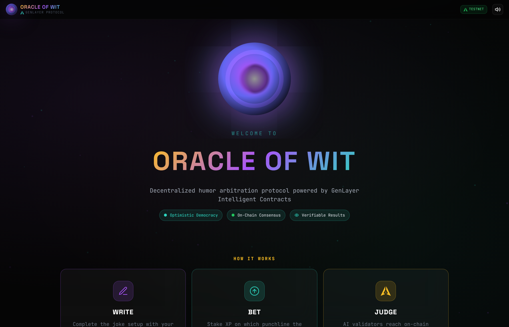
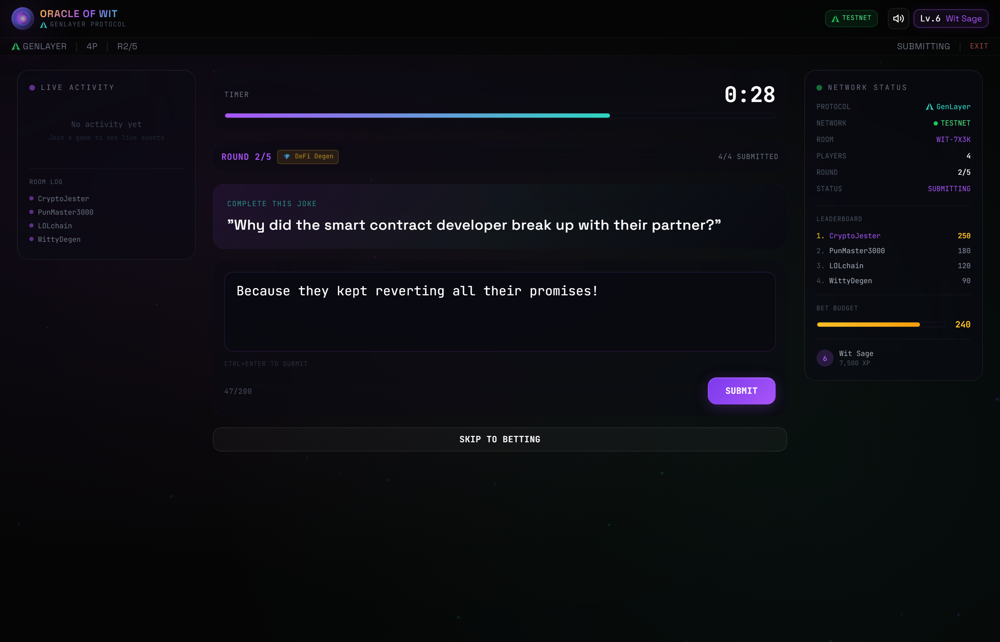
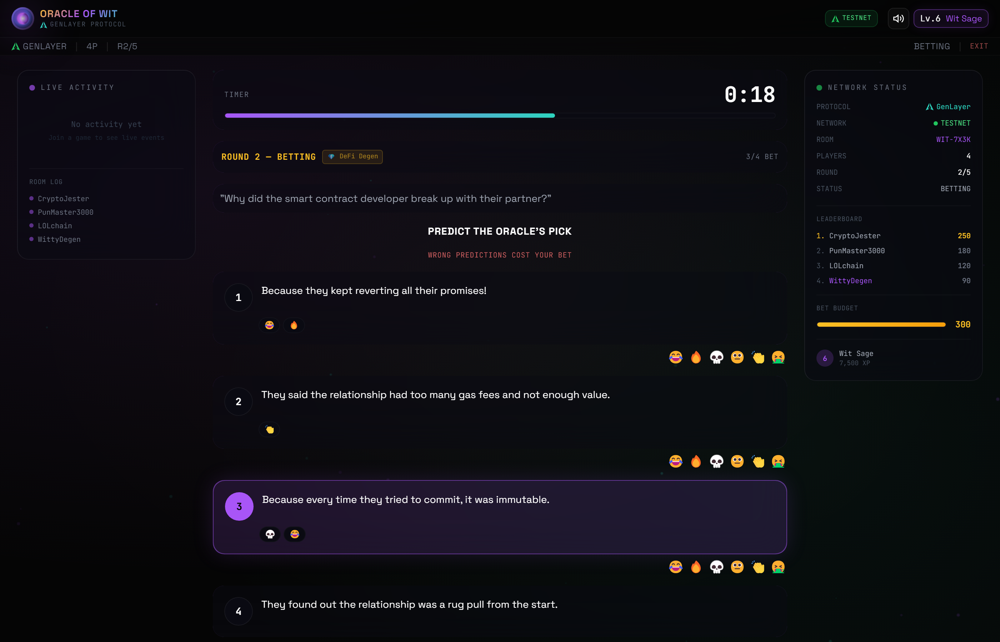
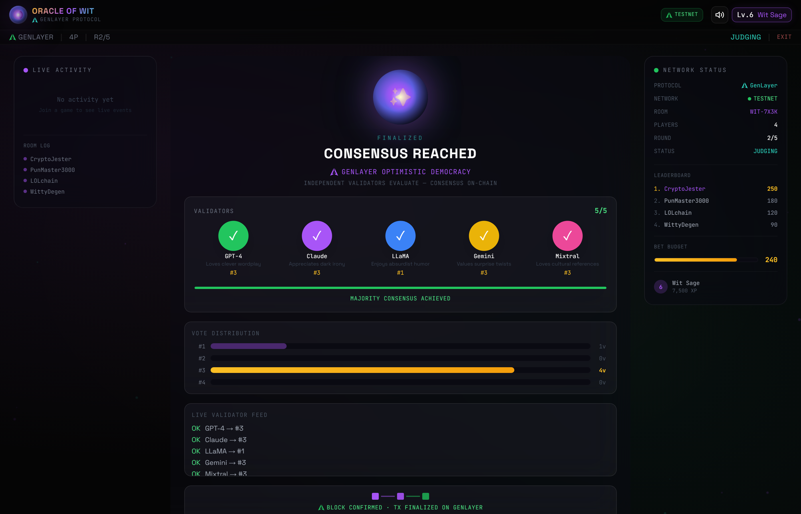
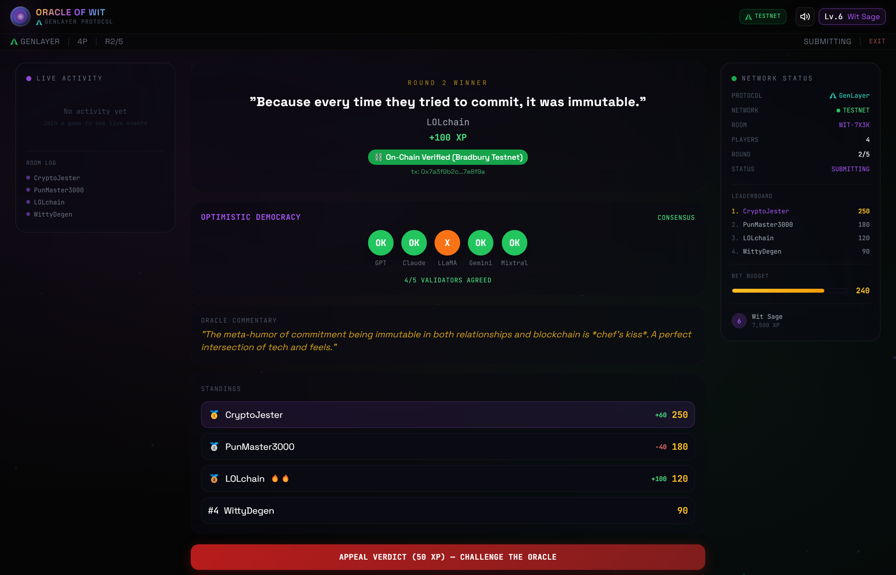
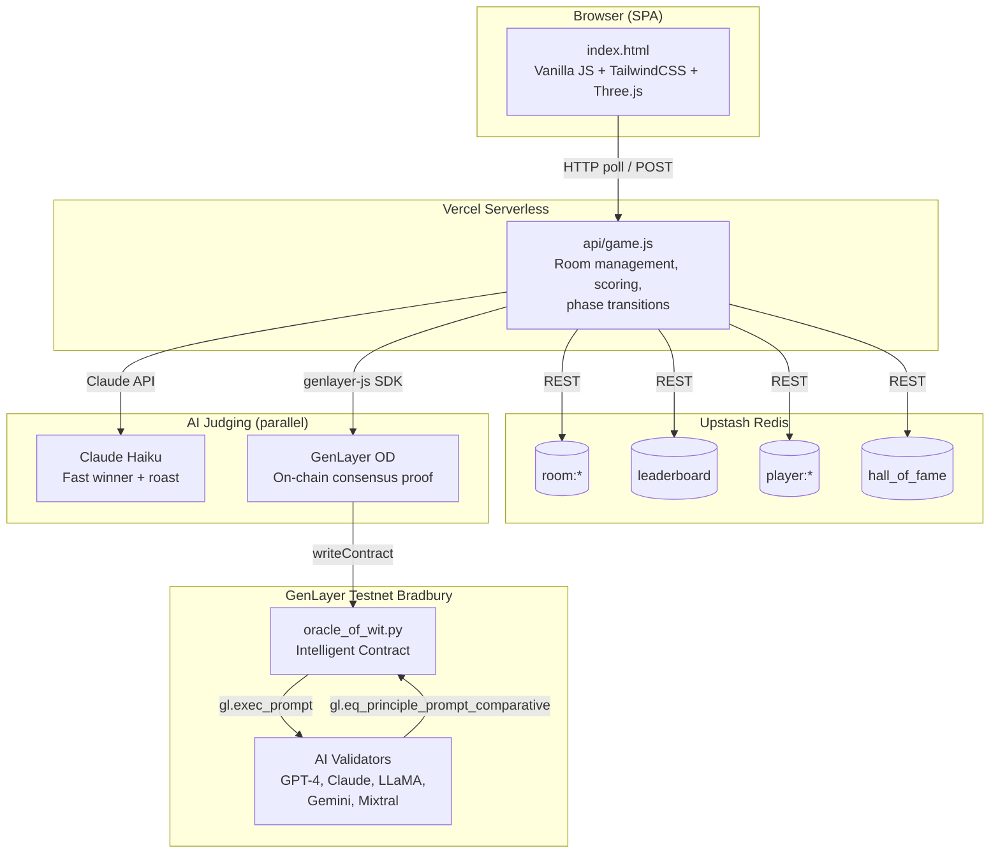
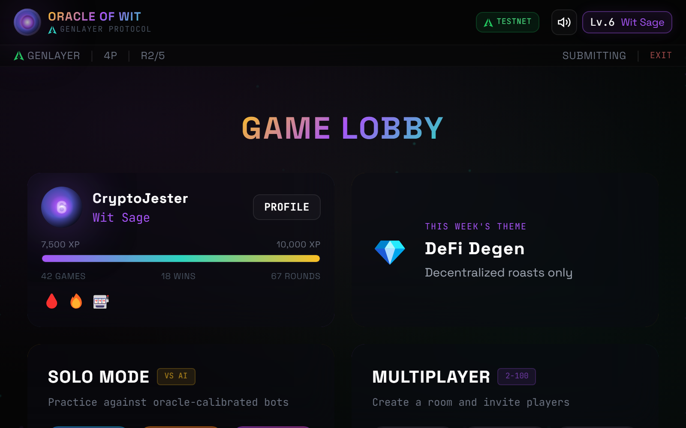

<div align="center">



# Oracle of Wit

**The AI humor prediction game powered by GenLayer Intelligent Contracts**

[](https://oracle-of-wit.vercel.app)
[](https://genlayer.com)
[]()
[](LICENSE)


[Play Now](https://oracle-of-wit.vercel.app) | [Report Bug](https://github.com/Ridwannurudeen/oracle-of-wit/issues) | [GenLayer Docs](https://docs.genlayer.com)

</div>

---

## Table of Contents

- [About](#about)
- [How to Play](#how-to-play)
- [Architecture](#architecture)
- [GenLayer Deep Dive](#genlayer-deep-dive)
- [Features](#features)
- [Tech Stack](#tech-stack)
- [Project Structure](#project-structure)
- [Getting Started](#getting-started)
- [Testing](#testing)
- [Contract API](#contract-api)
- [API Reference](#api-reference)
- [Discord Bot](#discord-bot)
- [Environment Variables](#environment-variables)
- [Contributing](#contributing)
- [License](#license)

---

## About

**Oracle of Wit** is a live multiplayer comedy game where players compete to write the funniest joke punchlines, bet on AI predictions, and earn XP. It showcases GenLayer's **Intelligent Contracts** and **Optimistic Democracy** consensus mechanism for decentralized, trustless AI judgment.

Write punchlines. Predict the Oracle's pick. Earn XP. All judged on-chain.

**Live Demo:** [oracle-of-wit.vercel.app](https://oracle-of-wit.vercel.app)

---

## How to Play

```
SUBMIT (40s)  ──>  BET (30s)  ──>  JUDGE (~10s)  ──>  REVEAL  ──>  REPEAT
```

### 1. Submit Your Punchline



The Oracle delivers a joke setup. You have 40 seconds to write the funniest punchline you can. All submissions are anonymous during betting.

### 2. Bet on the Winner



Read the anonymous punchlines, react with emojis, and stake your XP on which one the Oracle will choose. Wrong predictions cost you.

### 3. AI Validators Judge



Five AI validators (GPT-4, Claude, LLaMA, Gemini, Mixtral) independently evaluate every submission. They vote via GenLayer's Optimistic Democracy consensus — the result is recorded on-chain.

### 4. Winner Revealed



The winner is crowned with a gold card, confetti, and Oracle commentary. XP gains calculated. Standings updated. Appeal if you disagree.

### Scoring

| Action | XP |
|--------|----|
| Your joke wins | **+100** |
| Correct prediction | **+Bet x 2** |
| Wrong prediction | **-Bet amount** |
| Appeal (successful) | **+50 refund** |
| Appeal (denied) | **-50** |

---

## Architecture



**Dual-judge architecture:** GenLayer OD is the authoritative source when available (~2-3 validator rotations with `prompt_comparative`). Claude Haiku serves as a fast fallback if GenLayer times out or fails. Both run in parallel — GenLayer's result is preferred when it arrives within 30s.

---

## GenLayer Deep Dive


### Optimistic Democracy (OD)

GenLayer's OD consensus is the core innovation this dApp demonstrates. When `judge_round()` is called:

1. A **leader validator** executes the contract and proposes a result
2. Multiple **follower validators** independently re-execute and verify
3. The **Equivalence Principle** compares results across validators
4. If consensus is reached, the result is accepted and recorded on-chain
5. If validators disagree, more validators are added until consensus forms

### Equivalence Principle: `eq_principle_prompt_comparative`

Oracle of Wit uses the comparative equivalence principle — `gl.eq_principle_prompt_comparative` with the principle `"Both results must select the same winner ID number"`. Instead of requiring byte-identical JSON, validators only need to agree on the winner ID.

This dramatically reduces validator rotations (~2-3 rotations, ~10s finalization) compared to strict equality (~22 rotations, ~32 min), making GenLayer practical as the **authoritative judge** rather than just a background proof.

### Dual-Judge Architecture

GenLayer is the authoritative source of truth when available. Claude Haiku serves as a fast fallback:

1. Both GenLayer OD and Claude are called **in parallel**
2. If GenLayer returns a result within 30s → **it is used** (multi-validator consensus)
3. If GenLayer times out or fails → Claude's result is used as fallback
4. The `glOverride` flag in round metadata tracks which source was authoritative

### Appeal Mechanism

Players can appeal judgments via `appeal_judgment()`. OD naturally adds more validators for disputed transactions, making appeals inherently more rigorous. If the appeal overturns the original judgment, the contract automatically adjusts the on-chain leaderboard — removing XP from the old winner and awarding it to the new one.

### On-Chain State

| Storage | Type | Purpose |
|---------|------|---------|
| `games` | `TreeMap[str, str]` | Game state (host, category, status, rounds) |
| `leaderboard` | `TreeMap[str, int]` | Player name to total XP score |
| `player_games` | `TreeMap[str, str]` | Player name to list of game IDs |
| `seasons` | `TreeMap[str, str]` | Archived season leaderboards |
| `total_games` | `int` | Lifetime game counter |
| `total_judgments` | `int` | Lifetime OD judgment counter |

<details>
<summary><b>GenLayer SDK Usage (JavaScript)</b></summary>

```javascript
import { createClient, createAccount } from 'genlayer-js';
import { testnetBradbury } from 'genlayer-js/chains';

const account = createAccount(PRIVATE_KEY);
const client = createClient({ chain: testnetBradbury, account });

// Write call — triggers OD consensus
const txHash = await client.writeContract({
    address: CONTRACT_ADDRESS,
    functionName: 'judge_round',
    args: [gameId, jokeSetup, category, submissionsJson],
    value: 0n,
});

// View call — reads on-chain state directly
const history = await client.readContract({
    address: CONTRACT_ADDRESS,
    functionName: 'get_player_history',
    args: [playerName],
});
```

</details>

---

## Features

| | Feature | Description |
|-|---------|-------------|
| 1 | **Single Player** | Practice mode against 3 AI bot opponents |
| 2 | **Multiplayer** | Real-time games with 2-100 players |
| 3 | **Betting System** | Risk XP to predict the AI's choice |
| 4 | **Leaderboards** | Persistent global + seasonal rankings |
| 5 | **Levels & XP** | 10-level progression from Joke Rookie to Supreme Oracle |
| 6 | **Achievements** | 13 unlockable achievements (streaks, comebacks, milestones) |
| 7 | **Weekly Themes** | Rotating themes: Roast the AI, DeFi Degen, Office Humor |
| 8 | **On-Chain Judging** | GenLayer Optimistic Democracy consensus |
| 9 | **Discord Bot** | Slash commands for playing directly from Discord |
| 10 | **Appeal System** | Challenge any AI judgment via OD re-evaluation |
| 11 | **Player History** | On-chain game history per player |
| 12 | **Season System** | Archivable seasonal leaderboards |
| 13 | **Community Prompts** | User-submitted joke setups with voting |
| 14 | **Hall of Fame** | Historic winning jokes preserved |
| 15 | **Daily Oracle** | Daily challenge with streak tracking |
| 16 | **Dramatic Reveal** | Cinematic reveal sequence with confetti and sound effects |

### Game Categories

- **Tech** — Programming and tech industry jokes
- **Crypto** — Blockchain and DeFi humor
- **General** — Classic comedy for everyone

---

## Tech Stack

| Layer | Technology | Badge |
|-------|------------|-------|
| **Frontend** | Vanilla JavaScript, TailwindCSS, Three.js |    |
| **Backend** | Vercel Serverless Functions (Node.js) |   |
| **Database** | Upstash Redis |  |
| **AI Judging** | Claude Haiku (fast) + GenLayer OD (on-chain) |  |
| **Smart Contract** | GenLayer Intelligent Contract (Python) |  |
| **SDK** | genlayer-js v0.21+ |  |
| **Testing** | Vitest |  |

---

## Project Structure

```
oracle-of-wit/
├── index.html                 # SPA shell (HTML + CSS only, ~246 lines)
├── js/                        # Frontend JavaScript (split from index.html)
│   ├── state.js               # Global state variables, session token
│   ├── effects.js             # Particles, Three.js eye, audio, confetti
│   ├── api.js                 # API wrapper, polling, DOM micro-updates
│   ├── render.js              # All render*() functions, HUD, reveal
│   └── app.js                 # Game actions, timer, boot, event handlers
├── api/
│   ├── game.js                # Serverless API handler (~400 lines)
│   ├── discord.js             # Discord bot — slash commands via Interactions API
│   └── lib/                   # Extracted modules (split from monolithic game.js)
│       ├── redis.js           # Upstash REST helpers (GET/SET/INCR/SETNX/DEL)
│       ├── auth.js            # Session tokens, CORS whitelist, rate limiting
│       ├── constants.js       # Timers, levels, achievements, themes, prompts
│       ├── genlayer.js        # GenLayer SDK, submit/poll/record/appeal
│       ├── ai.js              # Claude judging, curation, bot punchlines
│       ├── game-logic.js      # Phase transitions, judging, bots, distributed lock
│       └── profiles.js        # Player profiles, daily challenges, leaderboard
├── contracts/
│   └── oracle_of_wit.py       # GenLayer Intelligent Contract
├── scripts/
│   ├── deploy.mjs             # Contract deployment to Testnet Bradbury
│   ├── register-commands.mjs  # Register Discord slash commands
│   └── capture-screenshots.mjs # Screenshot capture for README (Playwright)
├── tests/
│   ├── contract.test.js       # Contract logic unit tests (22 tests)
│   ├── api.test.js            # API integration tests (56 tests)
│   └── discord.test.js        # Discord bot tests (16 tests)
├── docs/
│   └── images/                # README screenshots (8 PNGs)
├── package.json               # Dependencies & scripts
├── vercel.json                # Vercel routing configuration
├── .env.example               # Environment variables template
└── README.md
```

---

## Getting Started

### Prerequisites

- Node.js 18+
- [Vercel CLI](https://vercel.com/cli) (`npm i -g vercel`)
- [Upstash Redis](https://upstash.com/) account
- [Anthropic API](https://console.anthropic.com/) key
- (Optional) GenLayer testnet wallet with GEN tokens

### Local Development

```bash
# Clone
git clone https://github.com/Ridwannurudeen/oracle-of-wit.git
cd oracle-of-wit

# Install
npm install

# Configure
cp .env.example .env
# Edit .env with your Upstash and Anthropic credentials

# Run locally
vercel dev

# Open http://localhost:3000
```

### Deploy to Production

```bash
vercel --prod
```

### Deploy Contract to GenLayer Testnet

```bash
# 1. Get GEN tokens from faucet
#    https://testnet-faucet.genlayer.foundation/

# 2. Set your private key
export GENLAYER_PRIVATE_KEY=0x...

# 3. Deploy
node scripts/deploy.mjs

# 4. Update env with the returned contract address
#    GENLAYER_CONTRACT_ADDRESS=0x...
```

---

## Testing

Oracle of Wit has **94 tests** across three test suites:

```bash
# Run all tests
npm test

# Watch mode
npm run test:watch
```

| Suite | File | Tests | Coverage |
|-------|------|-------|----------|
| **Contract** | `tests/contract.test.js` | 22 | Game creation, OD judging, leaderboard, appeals, seasons, idempotency, JSON safety |
| **API** | `tests/api.test.js` | 56 | Room CRUD, submissions, betting, voting, reactions, phase transitions, auth (session tokens), rate limiting, input validation, CORS |
| **Discord** | `tests/discord.test.js` | 16 | Ed25519 signatures, slash commands, error handling |

---

<details>
<summary><h2>Contract API</h2></summary>

### View Functions (read-only, no gas)

| Function | Parameters | Returns | Description |
|----------|------------|---------|-------------|
| `get_game(game_id)` | `str` | Game state dict or `None` | Fetch a game's on-chain state |
| `get_leaderboard(limit=20)` | `int` | List of `{name, score}` | Top players sorted by score |
| `get_stats()` | — | `{total_games, total_judgments}` | Contract lifetime statistics |
| `get_player_history(player_name)` | `str` | `{player_name, total_score, games_played, games[]}` | Player's full game history |
| `get_season(season_id)` | `str` | Archived season data or `None` | Historical season leaderboard |

### Write Functions (triggers OD consensus)

| Function | Parameters | Returns | Description |
|----------|------------|---------|-------------|
| `judge_round(...)` | `game_id, joke_setup, category, submissions` | `{winner_id, winner_name, winning_punchline, consensus_method}` | Judge punchlines via OD — the core gameplay function |
| `create_game(...)` | `game_id, host_name, category` | Game state dict | Register a new game on-chain |
| `record_game_result(...)` | `game_id, final_scores` | `{recorded, players_updated}` | Record final scores to leaderboard |
| `appeal_judgment(...)` | `game_id, joke_setup, category, submissions, original_winner_id` | `{new_winner_id, overturned, consensus_method}` | Re-evaluate a judgment via OD appeal |
| `season_reset(...)` | `season_id` | Archived season data | Archive current leaderboard and reset scores |

</details>

---

<details>
<summary><h2>API Reference</h2></summary>

All endpoints: `POST /api/game?action=<action>` (unless noted as GET)

| Action | Method | Parameters | Description |
|--------|--------|------------|-------------|
| `createRoom` | POST | `hostName`, `category`, `singlePlayer` | Create a new game room |
| `joinRoom` | POST | `roomId`, `playerName`, `spectator?` | Join existing room |
| `getRoom` | GET | `roomId` | Get room state |
| `startGame` | POST | `roomId`, `hostName` | Start game (host only) |
| `submitPunchline` | POST | `roomId`, `playerName`, `punchline` | Submit punchline |
| `placeBet` | POST | `roomId`, `playerName`, `submissionId`, `amount` | Place bet |
| `castVote` | POST | `roomId`, `playerName`, `submissionId` | Vote on curated submission |
| `advancePhase` | POST | `roomId`, `hostName` | Skip to next phase (host only) |
| `nextRound` | POST | `roomId`, `hostName` | Start next round |
| `listRooms` | GET | — | List public rooms |
| `getLeaderboard` | GET | — | Global rankings |
| `getSeasonalLeaderboard` | GET | `season?` | Monthly leaderboard |
| `getPlayerHistory` | GET/POST | `playerName` | On-chain player history |
| `getSeasonArchive` | GET/POST | `seasonId` | Archived season data |
| `getHallOfFame` | GET | — | Historic winning jokes |
| `submitPrompt` | POST | `playerName`, `prompt`, `playerId` | Submit community joke setup |
| `votePrompt` | POST | `promptId`, `playerId` | Vote on community prompt |

</details>

---

## Discord Bot



Oracle of Wit includes a Discord bot that lets users interact with the game directly from Discord using slash commands. It uses Discord's Interactions API (HTTP webhook) — no gateway or WebSocket needed, perfect for Vercel serverless.

### Slash Commands

| Command | Description |
|---------|-------------|
| `/play [category]` | Create a new game room (returns room code + join link) |
| `/leaderboard` | View the top 10 players |
| `/stats [player]` | View global or player-specific stats |
| `/joke [category]` | Get a random joke setup (ephemeral) |
| `/history <player>` | View a player's on-chain game history via GenLayer |

### Setup

1. Create a Discord application at [discord.com/developers](https://discord.com/developers/applications)
2. Copy your **Application ID**, **Public Key**, and **Bot Token**
3. Add them to your environment:
   ```bash
   DISCORD_APPLICATION_ID=your_app_id
   DISCORD_PUBLIC_KEY=your_public_key
   DISCORD_BOT_TOKEN=your_bot_token
   ```
4. Deploy to Vercel (the endpoint is auto-routed to `/api/discord`)
5. In the Discord Developer Portal, set **Interactions Endpoint URL** to:
   ```
   https://oracle-of-wit.vercel.app/api/discord
   ```
6. Register slash commands:
   ```bash
   npm run register-commands
   ```
7. Invite the bot to your server with the `applications.commands` scope

---

## Environment Variables

| Variable | Required | Description |
|----------|----------|-------------|
| `UPSTASH_REDIS_REST_URL` | Yes | Upstash Redis REST endpoint |
| `UPSTASH_REDIS_REST_TOKEN` | Yes | Upstash Redis auth token |
| `ANTHROPIC_API_KEY` | Yes | Claude API key for AI judging |
| `GENLAYER_RPC_URL` | No | GenLayer RPC endpoint (defaults to studio API) |
| `GENLAYER_CONTRACT_ADDRESS` | No | Deployed contract address (enables on-chain features) |
| `GENLAYER_PRIVATE_KEY` | No | Wallet key for contract interactions |
| `DISCORD_WEBHOOK_URL` | No | Discord webhook URL for posting game results |
| `DISCORD_APPLICATION_ID` | No | Discord app ID (for slash command registration) |
| `DISCORD_PUBLIC_KEY` | No | Discord public key (for Ed25519 signature verification) |
| `DISCORD_BOT_TOKEN` | No | Discord bot token (for command registration script) |

---

## Contributing

Contributions welcome!

1. Fork the repository
2. Create a feature branch (`git checkout -b feature/amazing-feature`)
3. Run tests (`npm test`)
4. Commit changes
5. Open a Pull Request

---

## License

MIT — see [LICENSE](LICENSE).

---

<div align="center">

| Resource | Link |
|----------|------|
| Play | [oracle-of-wit.vercel.app](https://oracle-of-wit.vercel.app) |
| GenLayer Docs | [docs.genlayer.com](https://docs.genlayer.com) |
| GenLayer Discord | [discord.gg/genlayer](https://discord.gg/genlayer) |
| GitHub | [github.com/Ridwannurudeen/oracle-of-wit](https://github.com/Ridwannurudeen/oracle-of-wit) |

</div>
