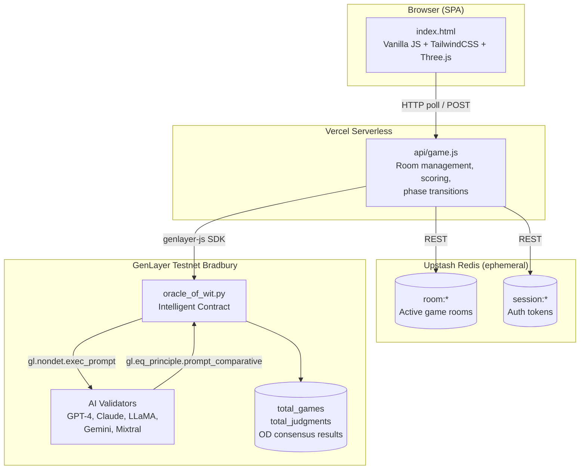

<div align="center">


# Oracle of Wit

**The AI humor prediction game powered by GenLayer Intelligent Contracts**

[](https://oracle-of-wit.vercel.app)
[](https://genlayer.com)
[]()
[](LICENSE)


[Play Now](https://oracle-of-wit.vercel.app) | [Report Bug](https://github.com/Ridwannurudeen/oracle-of-wit/issues) | [GenLayer Docs](https://docs.genlayer.com)

</div>

---

## Table of Contents

- [About](#about)
- [How to Play](#how-to-play)
- [Architecture](#architecture)
- [GenLayer Deep Dive](#genlayer-deep-dive)
- [Features](#features)
- [Tech Stack](#tech-stack)
- [Project Structure](#project-structure)
- [Getting Started](#getting-started)
- [Testing](#testing)
- [Contract API](#contract-api)
- [API Reference](#api-reference)
- [Discord Bot](#discord-bot)
- [Environment Variables](#environment-variables)
- [Contributing](#contributing)
- [License](#license)

---

## About

**Oracle of Wit** is a live multiplayer comedy game where players compete to write the funniest joke punchlines, bet on AI predictions, and earn XP. It showcases GenLayer's **Intelligent Contracts** and **Optimistic Democracy** consensus mechanism for decentralized, trustless AI judgment.

Write punchlines. Predict the Oracle's pick. Earn XP. All judged on-chain.

**Live Demo:** [oracle-of-wit.vercel.app](https://oracle-of-wit.vercel.app)

---

## How to Play

```
SUBMIT (40s)  ──>  BET (30s)  ──>  JUDGE (~10s)  ──>  REVEAL  ──>  REPEAT
```

### 1. Submit Your Punchline


The Oracle delivers a joke setup. You have 40 seconds to write the funniest punchline you can. All submissions are anonymous during betting.

### 2. Bet on the Winner


Read the anonymous punchlines, react with emojis, and stake your XP on which one the Oracle will choose. Wrong predictions cost you.

### 3. AI Validators Judge


Five AI validators (GPT-4, Claude, LLaMA, Gemini, Mixtral) independently evaluate every submission. They vote via GenLayer's Optimistic Democracy consensus — the result is recorded on-chain.

### 4. Winner Revealed


The winner is crowned with a gold card, confetti, and Oracle commentary. XP gains calculated. Standings updated. Appeal if you disagree.

### Scoring

| Action | XP |
|--------|----|
| Your joke wins | **+100** |
| Correct prediction | **+Bet x 2** |
| Wrong prediction | **-Bet amount** |
| Appeal (successful) | **+50 refund** |
| Appeal (denied) | **-50** |

---

## Architecture



**Native GenLayer architecture:** GenLayer is the sole AI judge and persistence layer. All judging, scoring, profiles, leaderboards, and hall of fame are on-chain. Redis handles only ephemeral room coordination and auth tokens. If GenLayer is unavailable, judging falls back to random selection (coin flip) — no silent AI fallback.

---

## GenLayer Deep Dive


### Optimistic Democracy (OD)

GenLayer's OD consensus is the core innovation this dApp demonstrates. When `judge_round()` is called:

1. A **leader validator** executes the contract and proposes a result
2. Multiple **follower validators** independently re-execute and verify
3. The **Equivalence Principle** compares results across validators
4. If consensus is reached, the result is accepted and recorded on-chain
5. If validators disagree, more validators are added until consensus forms

### Equivalence Principle: `gl.eq_principle.prompt_comparative`

Oracle of Wit uses the comparative equivalence principle — `gl.eq_principle.prompt_comparative` with the principle `"Both results must select the same winner ID number"`. Instead of requiring byte-identical JSON, validators only need to agree on the winner ID.

This dramatically reduces validator rotations (~2-3 rotations, ~10s finalization) compared to strict equality (~22 rotations, ~32 min), making GenLayer practical as the **authoritative judge** rather than just a background proof.

### Two-Block Judging

The `judge_round()` contract method uses a two-block pattern:

1. **Block 1** (`gl.eq_principle.prompt_comparative`): All validators independently pick the winner ID — they must agree
2. **Block 2** (`gl.eq_principle.prompt_non_comparative`): Leader generates roasts/commentary, validators grade quality

This returns both the winner and entertaining commentary in a single on-chain transaction.

### Appeal Mechanism

Players can appeal judgments via `appeal_judgment()`. OD naturally adds more validators for disputed transactions, making appeals inherently more rigorous. If the appeal overturns the original judgment, the backend automatically adjusts scores — removing XP from the old winner and awarding it to the new one.

### On-Chain State

| Storage | Type | Purpose |
|---------|------|---------|
| `total_games` | `u32` | Lifetime game counter |
| `total_judgments` | `u32` | Lifetime OD judgment counter |

> **Note:** Leaderboard, profiles, and game history are managed by Redis until Bradbury's `TreeMap[str, ...]` support stabilizes. The contract focuses on what only GenLayer can do: trustless AI consensus judging.

<details>
<summary><b>GenLayer SDK Usage (JavaScript)</b></summary>

```javascript
import { createClient, createAccount } from 'genlayer-js';
import { testnetBradbury } from 'genlayer-js/chains';

const account = createAccount(PRIVATE_KEY);
const client = createClient({ chain: testnetBradbury, account });

// Write call — triggers OD consensus
const txHash = await client.writeContract({
    address: CONTRACT_ADDRESS,
    functionName: 'judge_round',
    args: [gameId, jokeSetup, category, submissionsJson],
    value: 0n,
});

// View call — reads on-chain state directly
const history = await client.readContract({
    address: CONTRACT_ADDRESS,
    functionName: 'get_player_history',
    args: [playerName],
});
```

</details>

---

## Features

| | Feature | Description |
|-|---------|-------------|
| 1 | **Single Player** | Practice mode against 3 AI bot opponents |
| 2 | **Multiplayer** | Real-time games with 2-100 players |
| 3 | **Betting System** | Risk XP to predict the AI's choice |
| 4 | **Leaderboards** | Persistent global + seasonal rankings |
| 5 | **Levels & XP** | 10-level progression from Joke Rookie to Supreme Oracle |
| 6 | **Achievements** | 13 unlockable achievements (streaks, comebacks, milestones) |
| 7 | **Weekly Themes** | Rotating themes: Roast the AI, DeFi Degen, Office Humor |
| 8 | **On-Chain Judging** | GenLayer Optimistic Democracy consensus |
| 9 | **Discord Bot** | Slash commands for playing directly from Discord |
| 10 | **Appeal System** | Challenge any AI judgment via OD re-evaluation |
| 11 | **Player History** | On-chain game history per player |
| 12 | **Season System** | Archivable seasonal leaderboards |
| 13 | **Community Prompts** | User-submitted joke setups with voting |
| 14 | **Hall of Fame** | Historic winning jokes preserved |
| 15 | **Daily Oracle** | Daily challenge with streak tracking |
| 16 | **Dramatic Reveal** | Cinematic reveal sequence with confetti and sound effects |

### Game Categories

- **Tech** — Programming and tech industry jokes
- **Crypto** — Blockchain and DeFi humor
- **General** — Classic comedy for everyone

---

## Tech Stack

| Layer | Technology | Badge |
|-------|------------|-------|
| **Frontend** | Vanilla JS + Preact Islands, TailwindCSS, Three.js |    |
| **UI Components** | Preact + Preact Signals (islands architecture) |  |
| **Backend** | Vercel Serverless Functions (Node.js) |   |
| **Cache** | Upstash Redis (ephemeral rooms, auth) |  |
| **AI Judging** | GenLayer OD (on-chain consensus) |  |
| **Wallet Auth** | SIWE (EIP-4361) |  |
| **Smart Contract** | GenLayer Intelligent Contract (Python) |  |
| **SDK** | genlayer-js v0.23.1 |  |
| **Testing** | Vitest |  |

---

## Project Structure

```
oracle-of-wit/
├── index.html                 # SPA shell (HTML + CSS only, ~246 lines)
├── js/                        # Frontend JavaScript (split from index.html)
│   ├── main.js                # Entry point — imports app.js, registers service worker
│   ├── state.js               # Global state variables, session token
│   ├── signals.js             # Preact signals bridge — mirrors state.js for islands
│   ├── islands.js             # Preact island mounter — finds data-island placeholders
│   ├── events.js              # DOM event delegation (data-action click/input/keypress)
│   ├── effects.js             # Particles, Three.js eye, audio, confetti
│   ├── api.js                 # API wrapper, polling, DOM micro-updates
│   ├── render.js              # Main render dispatcher, HUD wings, screen routing
│   ├── render-helpers.js      # Shared render fragments (profile card, timer placeholders)
│   ├── render-lobby.js        # Welcome, lobby, waiting room screens
│   ├── render-game.js         # Submitting, betting, judging screens
│   ├── render-results.js      # Revealing, round results, final results screens
│   ├── render-screens.js      # Daily challenge, profile, hall of fame, community prompts
│   ├── app.js                 # Game actions, timer, boot, event handlers
│   └── components/            # Preact island components (JSX)
│       ├── ProfileCard.jsx    # Player profile card with XP bar
│       ├── Timer.jsx          # Self-updating countdown timer
│       └── WalletButton.jsx   # Connect/disconnect wallet button
├── api/
│   ├── game.js                # Serverless API handler (auth, routing, CORS)
│   ├── discord.js             # Discord bot — slash commands via Interactions API
│   ├── health.js              # Health check endpoint
│   ├── cron/
│   │   └── advance-games.js   # Cron job — auto-advance stale game phases
│   ├── _handlers/             # Action handler modules
│   │   ├── index.js           # Handler routing
│   │   ├── room.js            # Room CRUD
│   │   ├── gameplay.js        # Submissions, betting, judging
│   │   ├── profile.js         # Player profiles, daily challenges
│   │   ├── social.js          # Reactions, community prompts
│   │   └── meta.js            # Leaderboard, hall of fame, stats
│   └── _lib/                  # Shared server modules
│       ├── redis.js           # Upstash REST helpers (GET/SET/INCR/SETNX/DEL)
│       ├── auth.js            # Session tokens, CORS whitelist, rate limiting
│       ├── wallet-auth.js     # SIWE (EIP-4361) wallet authentication
│       ├── constants.js       # Timers, levels, achievements, themes, prompts
│       ├── genlayer.js        # GenLayer SDK, submit/poll/record/appeal/profiles
│       ├── game-logic.js      # Phase transitions, judging, bots, distributed lock
│       ├── profiles.js        # Player profiles, daily challenges, leaderboard
│       ├── logger.js          # Structured logging utility
│       ├── monitor.js         # Performance monitoring
│       └── types.js           # JSDoc type definitions
├── contracts/
│   └── oracle_of_wit.py       # GenLayer Intelligent Contract
├── scripts/
│   ├── deploy.mjs             # Contract deployment to Testnet Bradbury
│   ├── register-commands.mjs  # Register Discord slash commands
│   └── capture-screenshots.mjs # Screenshot capture for README (Playwright)
├── tests/
│   ├── test-helpers.js        # Shared test infrastructure (mocks, helpers)
│   ├── game-logic.test.js     # Core game-logic unit tests (44 tests)
│   ├── contract.test.js       # Contract logic unit tests (53 tests)
│   ├── api.test.js            # API handler tests (93 tests)
│   ├── integration.test.js    # Integration tests — lifecycle, race conditions (13 tests)
│   ├── frontend.test.js       # Frontend unit tests (84 tests)
│   ├── discord.test.js        # Discord bot tests (16 tests)
│   └── e2e/                   # End-to-end tests
├── docs/
│   └── images/                # README screenshots (8 PNGs)
├── package.json               # Dependencies & scripts
├── vercel.json                # Vercel routing configuration
├── .env.example               # Environment variables template
└── README.md
```

---

## Getting Started

### Prerequisites

- Node.js 18+
- [Vercel CLI](https://vercel.com/cli) (`npm i -g vercel`)
- [Upstash Redis](https://upstash.com/) account
- [GenLayer](https://studio.genlayer.com/) testnet wallet with GEN tokens

### Local Development

```bash
# Clone
git clone https://github.com/Ridwannurudeen/oracle-of-wit.git
cd oracle-of-wit

# Install
npm install

# Configure
cp .env.example .env
# Edit .env with your Upstash and GenLayer credentials

# Run locally
vercel dev

# Open http://localhost:3000
```

### Deploy to Production

```bash
vercel --prod
```

### Deploy Contract to GenLayer Testnet

```bash
# 1. Get GEN tokens from faucet
#    https://testnet-faucet.genlayer.foundation/

# 2. Set your private key
export GENLAYER_PRIVATE_KEY=0x...

# 3. Deploy
node scripts/deploy.mjs

# 4. Update env with the returned contract address
#    GENLAYER_CONTRACT_ADDRESS=0x...
```

---

## Testing

Oracle of Wit has **316 tests** across eight test suites:

```bash
# Run all tests
npm test

# Watch mode
npm run test:watch
```

| Suite | File | Tests | Coverage |
|-------|------|-------|----------|
| **Game Logic** | `tests/game-logic.test.js` | 37 | autoJudge, transitionFromSubmitting, createRoundResult, checkAutoAdvance, bot submissions/bets, prompts |
| **API** | `tests/api.test.js` | 97 | Room CRUD, submissions, betting, voting, reactions, phase transitions, auth, rate limiting, input validation, CORS |
| **Frontend** | `tests/frontend.test.js` | 88 | XSS escaping, auto-escape templates, DOM patching, timer formatting, state management, game events, adaptive polling |
| **Contract** | `tests/contract.test.js` | 73 | Game creation, OD judging, leaderboard, appeals, seasons, profiles, hall of fame, prompt pool |
| **GenLayer** | `tests/genlayer.test.js` | 27 | SDK wrappers, circuit breaker, poll results, profile/hall of fame read/write |
| **Integration** | `tests/integration.test.js` | 13 | Full lifecycle flows, double-advance prevention, polling resilience, auto-advance recovery, phase timer expiry |
| **Health** | `tests/health.test.js` | 6 | Health check endpoint, Redis/GenLayer status |
| **Discord** | `tests/discord.test.js` | 16 | Ed25519 signatures, slash commands, error handling |

---

<details>
<summary><h2>Contract API</h2></summary>

### View Functions (read-only, no gas)

| Function | Parameters | Returns | Description |
|----------|------------|---------|-------------|
| `get_stats()` | — | `{total_games, total_judgments}` | Contract lifetime statistics |

### Write Functions (triggers OD consensus)

| Function | Parameters | Returns | Description |
|----------|------------|---------|-------------|
| `judge_round(...)` | `game_id, joke_setup, category, submissions` | `{winner_id, winner_name, winning_punchline, consensus_method, commentary}` | Judge punchlines via OD — the core gameplay function |
| `appeal_judgment(...)` | `game_id, joke_setup, category, submissions, original_winner_id` | `{new_winner_id, overturned, consensus_method}` | Re-evaluate a judgment via OD appeal |
| `record_game_count()` | — | `{total_games}` | Increment the lifetime game counter |

</details>

---

<details>
<summary><h2>API Reference</h2></summary>

All endpoints: `POST /api/game?action=<action>` (unless noted as GET)

| Action | Method | Parameters | Description |
|--------|--------|------------|-------------|
| `createRoom` | POST | `hostName`, `category`, `singlePlayer` | Create a new game room |
| `joinRoom` | POST | `roomId`, `playerName`, `spectator?` | Join existing room |
| `getRoom` | GET | `roomId` | Get room state |
| `startGame` | POST | `roomId`, `hostName` | Start game (host only) |
| `submitPunchline` | POST | `roomId`, `playerName`, `punchline` | Submit punchline |
| `placeBet` | POST | `roomId`, `playerName`, `submissionId`, `amount` | Place bet |
| `advancePhase` | POST | `roomId`, `hostName` | Skip to next phase (host only) |
| `nextRound` | POST | `roomId`, `hostName` | Start next round |
| `listRooms` | GET | — | List public rooms |
| `getLeaderboard` | GET | — | Global rankings |
| `getSeasonalLeaderboard` | GET | `season?` | Monthly leaderboard |
| `getPlayerHistory` | GET/POST | `playerName` | On-chain player history |
| `getSeasonArchive` | GET/POST | `seasonId` | Archived season data |
| `getHallOfFame` | GET | — | Historic winning jokes |
| `submitPrompt` | POST | `playerName`, `prompt`, `playerId` | Submit community joke setup |
| `votePrompt` | POST | `promptId`, `playerId` | Vote on community prompt |

</details>

---

## Discord Bot


Oracle of Wit includes a Discord bot that lets users interact with the game directly from Discord using slash commands. It uses Discord's Interactions API (HTTP webhook) — no gateway or WebSocket needed, perfect for Vercel serverless.

### Slash Commands

| Command | Description |
|---------|-------------|
| `/play [category]` | Create a new game room (returns room code + join link) |
| `/leaderboard` | View the top 10 players |
| `/stats [player]` | View global or player-specific stats |
| `/joke [category]` | Get a random joke setup (ephemeral) |
| `/history <player>` | View a player's on-chain game history via GenLayer |

### Setup

1. Create a Discord application at [discord.com/developers](https://discord.com/developers/applications)
2. Copy your **Application ID**, **Public Key**, and **Bot Token**
3. Add them to your environment:
   ```bash
   DISCORD_APPLICATION_ID=your_app_id
   DISCORD_PUBLIC_KEY=your_public_key
   DISCORD_BOT_TOKEN=your_bot_token
   ```
4. Deploy to Vercel (the endpoint is auto-routed to `/api/discord`)
5. In the Discord Developer Portal, set **Interactions Endpoint URL** to:
   ```
   https://oracle-of-wit.vercel.app/api/discord
   ```
6. Register slash commands:
   ```bash
   npm run register-commands
   ```
7. Invite the bot to your server with the `applications.commands` scope

---

## Environment Variables

| Variable | Required | Description |
|----------|----------|-------------|
| `UPSTASH_REDIS_REST_URL` | Yes | Upstash Redis REST endpoint |
| `UPSTASH_REDIS_REST_TOKEN` | Yes | Upstash Redis auth token |
| `GENLAYER_RPC_URL` | Yes | GenLayer RPC endpoint (defaults to studio API) |
| `GENLAYER_CONTRACT_ADDRESS` | Yes | Deployed contract address |
| `GENLAYER_PRIVATE_KEY` | Yes | Wallet key for contract interactions |
| `DISCORD_WEBHOOK_URL` | No | Discord webhook URL for posting game results |
| `DISCORD_APPLICATION_ID` | No | Discord app ID (for slash command registration) |
| `DISCORD_PUBLIC_KEY` | No | Discord public key (for Ed25519 signature verification) |
| `DISCORD_BOT_TOKEN` | No | Discord bot token (for command registration script) |
| `CRON_SECRET` | No | Secret for cron job authentication (advance-games) |

---

## Contributing

Contributions welcome!

1. Fork the repository
2. Create a feature branch (`git checkout -b feature/amazing-feature`)
3. Run tests (`npm test`)
4. Commit changes
5. Open a Pull Request

---

## License

MIT — see [LICENSE](LICENSE).

---

<div align="center">

| Resource | Link |
|----------|------|
| Play | [oracle-of-wit.vercel.app](https://oracle-of-wit.vercel.app) |
| GenLayer Docs | [docs.genlayer.com](https://docs.genlayer.com) |
| GenLayer Discord | [discord.gg/genlayer](https://discord.gg/genlayer) |
| GitHub | [github.com/Ridwannurudeen/oracle-of-wit](https://github.com/Ridwannurudeen/oracle-of-wit) |

</div>
